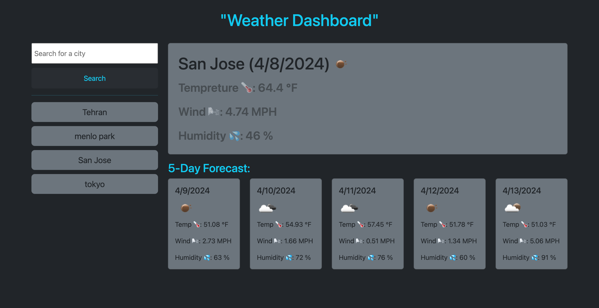

# weather
Weather Forecast Application:
This project is a weather forecast application that provides current weather information and a 5-day forecast based on the user's search. It utilizes the OpenWeatherMap API to retrieve weather data based on location.

.Motivation:

The motivation behind this project is to create a simple and user-friendly weather forecast application that allows users to quickly access weather information for any location.

.Features

Display current weather information including temperature, wind speed, and humidity.
Show a 5-day forecast with weather details for each day.
Store search history locally for easy access to previously searched 
locations.
Responsive design for seamless usage on various devices.

.How to Use:

Search: Enter the name of a city in the search input and submit the form to retrieve weather information for that location.
View Weather: Once the weather data is retrieved, the current weather and 5-day forecast will be displayed.
Search History: Previously searched cities are displayed below the search input. Click on a city button to view weather information for that location again.

.Installation:

Clone the repository to your local machine.
Open the index.html file in a web browser.

.Technologies Used:

HTML
CSS
JavaScript
OpenWeatherMap API
Day.js library for date formatting

.Usage:

.Credits:

OpenWeatherMap for providing the weather data API.
Day.js for date formatting in JavaScript.

.License:

This project is licensed under the MIT License. See the LICENSE file for details.

